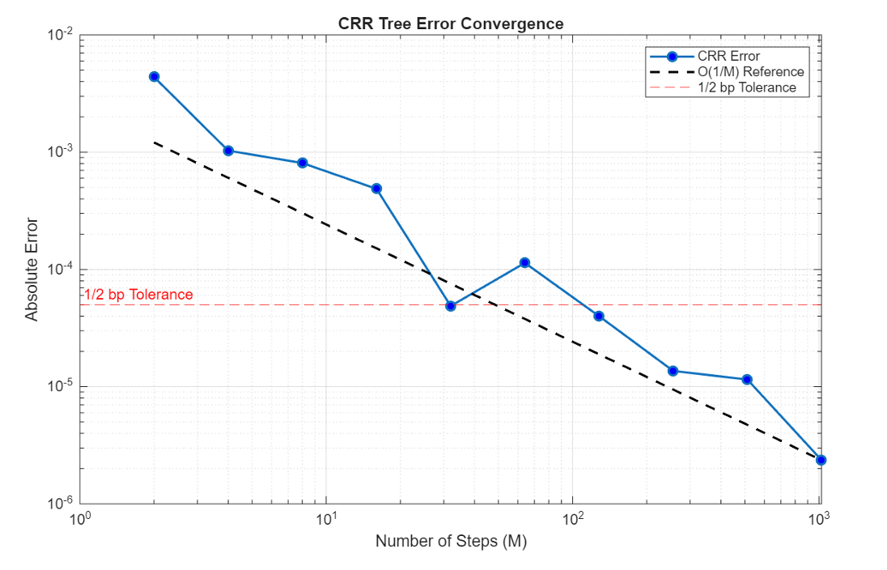

# Option Pricing Models

MATLAB implementation of pricing engines for plain-vanilla and exotic options, with convergence analysis and Greeks computation.  
*Financial Engineering — MSc Quantitative Finance, Politecnico di Milano (A.Y. 2025–2026)*

---

## Methods

**Black-76 Closed Form** — used as the analytical benchmark. Prices are derived under the T-forward measure, where the forward price F₀ follows a GBM. For barrier options, the closed form decomposes as `Call(K) − Call(KO) − (KO − K) · Digital(KO)`, exploiting the linear structure of the truncated payoff.

**CRR Binomial Tree** — discrete-time lattice with up/down factors `u = exp(σ√dt)`, `d = 1/u` and risk-neutral probability `p = (1−d)/(u−d)`. Option values are recovered via backward induction. For barrier options, terminal nodes above the KO level are zeroed before induction. For the Bermudan, early exercise is tested at each exercise date by comparing continuation value against intrinsic value.

**Monte Carlo** — risk-neutral simulation of the terminal forward price under the log-normal dynamics. Variance is reduced via antithetic variables: for each draw Z, a symmetric path −Z is generated, exploiting the martingale property of the Wiener process to reduce the variance without additional random draws.

---

## Key Results

**Convergence & Error Scaling**  
CRR error scales as O(1/M) and MC as O(1/√M), confirmed on a log-log scale. The CRR error oscillates around the convergence envelope — a well-known artifact of the strike drifting in and out of alignment with tree nodes as M varies. Using a market bid/ask tolerance of 0.5 bp as threshold, CRR becomes reliably stable at M = 2⁷ = 128 steps, while MC requires M = 2²⁰ ≈ 1M simulations. The binomial tree converges orders of magnitude faster for plain-vanilla European options.


**Vega of the Up&Out Barrier Option**  
The Vega profile has a sign change that is financially meaningful. When S₀ is far from the barrier, the option behaves like a vanilla call — higher volatility increases the probability of finishing ITM, so Vega is positive. As S₀ approaches 1.40 €, Vega turns sharply negative: in this region, volatility is the enemy of the option holder because it increases the probability of breaching the barrier and being knocked out. This sign reversal is not a numerical artifact — it reflects a genuine change in the dominant risk driver.  
On the numerical side, computing Vega via central finite differences on the CRR tree produces severe "sawtooth" oscillations near the barrier. A small perturbation Δσ expands the tree grid, causing previously safe nodes to breach the barrier discontinuously — a sharp drop in option value that, divided by a small Δσ, generates massive spikes in the estimated derivative. The Monte Carlo avoids this by reusing the same set of random draws for both σ+h and σ−h, keeping the two estimates correlated and the finite difference well-behaved.

**American vs. European Barrier**  
The American Up&Out Call (0.0147 €) is strictly cheaper than the European (0.0154 €). The reason is structural: the European barrier is checked only at maturity, so a path that crosses 1.40 € intralife and falls back below it by expiry survives and pays off. The American barrier kills the option on first touch — continuous monitoring makes knock-out strictly more likely, destroying value. The Delta of the American option drops discontinuously to zero at S₀ = 1.40 € (immediate knock-out), while the European Delta is smooth through the barrier level.

**Bermudan vs. European Call**  
With exercise dates at months 1, 2, and 3, the Bermudan price matches the European (0.0163 €) throughout the relevant dividend range. This is consistent with theory: early exercise on a call is only optimal when the dividend yield q is high enough to compensate for the time value of money lost by paying the strike early. Here r = 2.5% > q = 2%, so the interest earned on the unpaid strike dominates — the rational holder never exercises early, making the Bermudan financially equivalent to the European contract.

---

## How to Run

```matlab
addpath('/path/to/option-pricing-models')
runAssignment1_Group6
```
Requires MATLAB Financial Toolbox (`blkprice`, `normcdf`).

---

**Stefano De Amici** · [LinkedIn](https://linkedin.com/in/stefano-de-amici-7b84a0238)
